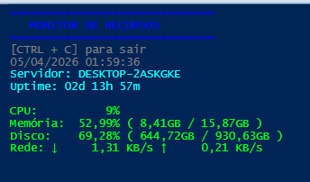

# 🖥️ Windows Resource Monitor (PowerShell)

## 📌 Descrição

Este projeto consiste em uma ferramenta de monitoramento de recursos do sistema desenvolvida em PowerShell.

A aplicação foi criada com o objetivo de acompanhar, em tempo real, o uso de CPU, memória, disco e rede em ambientes Windows, auxiliando na identificação de gargalos e possíveis anomalias.

---

## 🚀 Funcionalidades

* 📊 Monitoramento em tempo real de:

  * CPU
  * Memória RAM
  * Disco (C:)
  * Rede

* 🎨 Indicadores visuais com cores:

  * 🟢 Normal
  * 🟡 Atenção
  * 🔴 Crítico

* ⚠️ Alertas automáticos para uso crítico de recursos

* 🕒 Exibição de:

  * Data e hora atual
  * Uptime do sistema
  * Nome do servidor

* 📁 Geração de log com histórico de uso

---

## 🛠️ Tecnologias utilizadas

* PowerShell
* WMI / CIM (`Get-CimInstance`)

---

## ▶️ Como executar

1. Clone o repositório:

```bash
git clone https://github.com/luizotaviomartins044/windows-resource-monitor-ps.git
```

2. Acesse a pasta:

```bash
cd windows-resource-monitor-ps
```

3. Execute o script:

```powershell
.\monitor.ps1
```

---

---

## 🌐 Execução remota (Invoke-Command)

Também é possível executar o script remotamente em servidores Windows utilizando PowerShell Remoting (WinRM).

### 📌 Pré-requisitos

* PowerShell Remoting habilitado no servidor:

```powershell
Enable-PSRemoting -Force
```

* Permissão de acesso remoto ao servidor

---

### ▶️ Executando remotamente

```powershell
Invoke-Command -ComputerName "NOME_DO_SERVIDOR" -FilePath ".\monitor.ps1"
```

---

### 🔐 Executando com credenciais

```powershell
$cred = Get-Credential

Invoke-Command -ComputerName "NOME_DO_SERVIDOR" `
    -Credential $cred `
    -FilePath ".\monitor.ps1"
```

---

### 📡 Monitorando múltiplos servidores

```powershell
$servers = @("SRV01", "SRV02", "SRV03")

Invoke-Command -ComputerName $servers -FilePath ".\monitor.ps1"
```

---

### ⚠️ Observações

* O WinRM deve estar habilitado nos servidores remotos
* Pode ser necessário configurar firewall e TrustedHosts
* Para ambientes em domínio, a autenticação é simplificada

---


## 📸 Screenshot



---

## 🔮 Melhorias futuras

* Monitoramento remoto de múltiplos servidores
* Integração com API
* Armazenamento em banco de dados
* Dashboard web para visualização gráfica
* Sistema de alertas (email/webhook)

---

## 📄 Licença

Este projeto está sob a licença MIT.

---

## 👨‍💻 Autor

Luiz Otávio Martins
